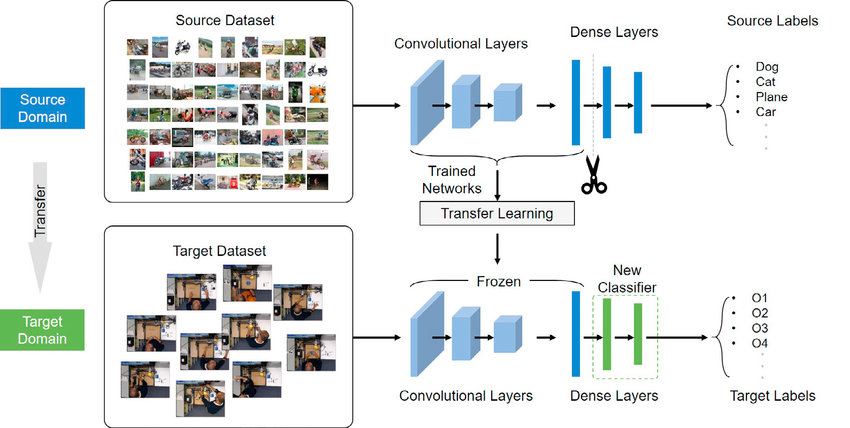

# Pre-training-and-Fine-Tuning-with-PyTorch

**Transfer learning** is a powerful technique in machine learning where we apply knowledge gained from solving one problem to a different but related problem. Imagine it like this: rather than starting from scratch every time, we use the insights and lessons learned from a model that was trained on a large and comprehensive dataset, and apply them to our specific task. For instance, we could take a model that has been trained to recognize a myriad of objects in millions of images, such as those from the ImageNet dataset, and use that knowledge to boost our own image-related project. Similarly, in the world of text and language, a model that has been fed vast amounts of text to understand and interpret language can be repurposed to help classify different text samples in our own work. This approach is like standing on the shoulders of giants – we leverage the hard work and learning a model has already done, and use it to give our project a head start. The key idea is to find a model that excels in a certain area and adapt its strengths to our unique challenges, thereby enhancing the performance and efficiency of our own model.


**Pre-Trained Models** are a direct outcome of transfer learning. These models are trained on large benchmark datasets and tasks, and then made available for others to use. These models have already learned a large set of features, which can be a very effective starting point for training a model on a new task.
For instance, in computer vision, models like VGG, ResNet, and Inception are trained on the ImageNet dataset, which contains millions of labelled images in thousands of categories. In natural language processing, models like BERT, GPT, and T5 are trained on extensive text corpora and can be used for tasks like language translation, question-answering, and text generation.
Using pre-trained models can significantly reduce the time, computational cost, and the amount of data required to train an effective model. They provide a major advantage in that they reduce the need for a large amount of computational resources and expertise to train a model from scratch.

**Fine-Tuning** is a process that tweaks a pre-trained model to adapt it more closely to the specific characteristics of the task at hand. It involves continuing the training of the model on a new task, using a smaller dataset specific to that task.

During fine-tuning, the pre-trained model is adjusted in such a way that the model's weights are 'fine-tuned' to the new task. This usually involves a few steps: initially, the model's existing weights are frozen, and only the last few layers are trained on the new data. Once these layers have been sufficiently trained, the earlier layers can be unfrozen and the entire model can be trained (to a smaller extent) on the new data.
Fine-tuning allows the model to transfer the knowledge it has learned from the previous task (like recognizing shapes or understanding language structure) to the new task. This results in a much more efficient training process than training a model from scratch, as the model already has a good understanding of the general features and only needs to adjust its understanding to the specifics of the new task.


# Why we use transfer learning 

If we are building a computer vision application rather than training the weights from scratch, from random initialization we often make much faster progress if we download weights that someone else already trained on the network architecture and use that as a pre-trained and transfer that to a new task that we might be interested in. The ComputerVision Research community has been pretty good at posting lots of datasets on the internet like for example :- ImageNet, MsCOCO.

Sometimes training takes several weeks and might take many many GPU's and the fact that someone else's done this and gone through the pain of hyper parameter searching process, means we can often download open source weights that took someone else many weeks or month to figure out and use that as a very good initialization for our neural network and use transfer learning to shift that knowledge in to our mini-problem. 

Let's see one Motivating Example :- Let's say we are building a cat detector to recognize our own pet cat called tiger, misty and neither. So we have a classification problem with three classes and we probably don't have a lot of pictures of tiger and misty. So our training set will be small. So what can we do ? We can go online and download some open source implementation and not just the code but also the weights and there are a lot of neural networks that are trained with datasets like ImageNet. The Network trained by ImageNet dataset has an output class of 1000 with a softmax unit. What we can do is get rid of the softmax layer and create our own softmax unit that outputs tiger, misty and neither. And  in terms of the network it's better to think all of these layers are frozen, so freeze the parameters in all of this layer of the network and we would just train the parameters associated with our softmax layer.


And by using someone else's pre-trained weights we might be able to get pretty good performance even on a small dataset. A lot of deep learning frameworks support this mode operation and depending on the framework it might have things like trainable parameters = 0 to set that for those earlier layers in order to say, don't train those earlier layers,  or sometimes we have a parameter freeze = 1, so these are our parameters that let's us whether or not to train the weights associated with a particular layer.
One rule of thumb is if we have a larger label data set so maybe we just have a ton of pictures of Tigger, Misty as well as pictures of neither, one thing we could do is then freeze fewer layers. Maybe we freeze just the top layers and then train the later layers. Although if the output layer has different classes then we need to have our own output unit, which is Tigger, Misty or neither. There are a couple of ways to do this. 

* We could take the last few layers and just use that as initialization and do gradient descent from there

* we can also blow away these last few layers and just use our own new hidden units and our own final softmax outputs. 

* Another pattern is if we have more data, the number of layers we’ve frozen could be smaller and then the number of layers we train on top could be greater. The idea is that if we pick a data set and maybe have enough data not just to train a single softmax unit but to train some other size neural network that comprises the last few layers of this final network that we end up using.



Finally, if we have a lot of data, one thing we might do is take this open source network and use the whole thing just as initialization and train the whole network. Although if this was a thousand of softmax and we have just three outputs, we need our own softmax output. The output of labels we care about. But the more label data we have for your task or the more pictures we have of Tigger, Misty and neither, the more layers we could train and in the extreme case, we could use the ways we download just as initialization, so they would replace random initialization and then could do gradient descent, training updating all the ways and all the layers of the network. That's transfer learning for the training of ConvNets.

# Implementation of Transfer Learning 

## Getting a pre-trained model 

The whole idea of transfer learning is to take an already well-performing model on a problem space similar to ours then customizing it to our case. When we are working on computer vision and NLP problems, we can find pre-trained classification models in torchvision.models and torchtext.models.
 
```python
import torch
from torchtext import models
dir(models) 

```
Output:
```
 'FLAN_T5_BASE',
 'FLAN_T5_BASE_ENCODER',
 'ROBERTA_BASE_ENCODER',
 'T5Transform',
 'T5_LARGE',
 'T5_LARGE_ENCODER',
 'T5_LARGE_GENERATION',
 'XLMR_BASE_ENCODER',
 'XLMR_LARGE_ENCODER',

```

```python
import torch
from torchvision import models
dir(models) 

```
Output:
```
 'AlexNet',
 'AlexNet_Weights',
 'ConvNeXt',
 'VGG'
 'VGG16_Weights',
 'alexnet',
 'convnext',
 'resnet101',
 'resnet152',
 'resnext101_32x8d'
 'segmentation',
 'shufflenet_v2_x0_5',
 'vgg16',
 'vit_b_32'
```

## Which pre-trained models to use 

It depends on our problem or the device we are working with. Generally higher suffix numbers in the model name for example, efficientnet_b0() --> efficientnet_b1() --> efficientnet_b7()), means better performance but a larger model. We might think better performance is always better, that is true but some better performing models are too big for some devices. For example, say we would like to run our model on a mobile-device, we'll have to take into account the limited compute resources on the device, thus we would be looking for a smaller model. But if we've got unlimited compute power, we'd likely take the biggest.

## Setting up a pre-trained model

The pre-trained model we're going to be using is from torchvision.models.
 
* The old way(the depreciated one) of using a pre-trained model :- 
    `torchvision.models.efficientnet_b0(pretrained  = True)`

* The new way of using a pre-trained model :- 
    `weights = 'torchvision.models.Efficient_B0_Weights.DEFAULT`
    `torchvision.models.efficientnet_b0(weights = weights).to(device)`

## Efficient Network Architecture
```python
import torch
import torchvision

weights = torchvision.models.EfficientNet_B0_Weights.DEFAULT  # DEFAULT means it's best available weights
model_efficientnet = torchvision.models.efficientnet_b0(weights=weights).to(torch.device("cuda"))
print(model_efficientnet)

```


## The VGG16 Network Architecture
```python
import torch
import torchvision
weights = torchvision.models.VGG16_Weights.DEFAULT
model = torchvision.models.vgg16(weights = weights).to(torch.device("cuda"))
```

## The AlexNet Architecture
```python
import torch
import torchvision

weights = torchvision.models.AlexNet_Weights.DEFAULT
model_alexnet  = torchvision.models.alexnet(weights =  weights).to(torch.device("cuda"))
```
## The Resnet Architecture

```python
import torch
import torchvision
weights = torchvision.models.ResNet101_Weights.DEFAULT
model_resnet = torchvision.models.resnet101(weights = weights).to(torch.device("cuda"))
```
## The GoogLNet Architecture

```python 
import torch
import torchvision
weights = torchvision.models.GoogLeNet_Weights.DEFAULT
model_googLeNet = torchvision.models.googlenet(weights  = weights).to(torch.device("cuda"))
```
## The Vision Transformer

```python
import torch
import torchvision
model_vision_transformer = torchvision.models.VisionTransformer
model_vision_transformer
```

## Getting a summary of our model 

```python
import torch
import torchvision

weights = torchvision.models.VGG16_Weights.DEFAULT
model_vgg = torchvision.models.vgg16(weights = weights).to(torch.device("cuda"))
```
```python
from torchsummary import summary
summary(model = model_vgg , input_size = (3 , 32 , 32) , batch_size = 64 , device = "cuda")
```
```
----------------------------------------------------------------
        Layer (type)               Output Shape         Param #
================================================================
            Conv2d-1           [64, 64, 32, 32]           1,792
              ReLU-2           [64, 64, 32, 32]               0
            Conv2d-3           [64, 64, 32, 32]          36,928
              ReLU-4           [64, 64, 32, 32]               0
         MaxPool2d-5           [64, 64, 16, 16]               0
            Conv2d-6          [64, 128, 16, 16]          73,856
              ReLU-7          [64, 128, 16, 16]               0
            Conv2d-8          [64, 128, 16, 16]         147,584
              ReLU-9          [64, 128, 16, 16]               0
        MaxPool2d-10            [64, 128, 8, 8]               0
           Conv2d-11            [64, 256, 8, 8]         295,168
             ReLU-12            [64, 256, 8, 8]               0
           Conv2d-13            [64, 256, 8, 8]         590,080
             ReLU-14            [64, 256, 8, 8]               0
           Conv2d-15            [64, 256, 8, 8]         590,080
             ReLU-16            [64, 256, 8, 8]               0
        MaxPool2d-17            [64, 256, 4, 4]               0
           Conv2d-18            [64, 512, 4, 4]       1,180,160
             ReLU-19            [64, 512, 4, 4]               0
           Conv2d-20            [64, 512, 4, 4]       2,359,808
             ReLU-21            [64, 512, 4, 4]               0
           Conv2d-22            [64, 512, 4, 4]       2,359,808
             ReLU-23            [64, 512, 4, 4]               0
        MaxPool2d-24            [64, 512, 2, 2]               0
           Conv2d-25            [64, 512, 2, 2]       2,359,808
             ReLU-26            [64, 512, 2, 2]               0
           Conv2d-27            [64, 512, 2, 2]       2,359,808
             ReLU-28            [64, 512, 2, 2]               0
           Conv2d-29            [64, 512, 2, 2]       2,359,808
             ReLU-30            [64, 512, 2, 2]               0
        MaxPool2d-31            [64, 512, 1, 1]               0
AdaptiveAvgPool2d-32            [64, 512, 7, 7]               0
           Linear-33                 [64, 4096]     102,764,544
             ReLU-34                 [64, 4096]               0
          Dropout-35                 [64, 4096]               0
           Linear-36                 [64, 4096]      16,781,312
             ReLU-37                 [64, 4096]               0
          Dropout-38                 [64, 4096]               0
           Linear-39                 [64, 1000]       4,097,000
================================================================
Total params: 138,357,544
Trainable params: 138,357,544
Non-trainable params: 0
----------------------------------------------------------------
Input size (MB): 0.75
Forward/backward pass size (MB): 309.99
Params size (MB): 527.79
Estimated Total Size (MB): 838.53
----------------------------------------------------------------

```
## Freezing the model

The process of transfer learning usually goes: freeze some base layers of a pre-trained model and then adjust the output layers (also called the classifier layers ) to suit our needs.We can customize the outputs of a pre-trained model by changing the output layers to suit our problem. For example, The original `torchvision.models.efficientnet_b0()` comes with output `features of 1000` because there are 1000 classes in ImageNet, the dataset it was trained on. However, for our problem, we might not need that much output, so let's say our problem needs `out_features = 3`. So let's freeze all of the layers parameters in the feature section of our model. Note that to freeze layers means to keep them how they are during training. For example, if our model has pre-trained layers, to freeze them would be like saying, "don't change any of the patterns in these layers during training. Leave them how they are." We can freeze all of the layers parameters in the features section by setting the attribute `requires_grad = False`. For parameters with `requires_grad = False` PyTorch doesn't track gradient updates and in turn, these parameters won't be changed by our optimizer during training.


```python
for params in model_vgg.parameters():
params.requires_grad = False

```
## Summarize after freezing
```python
from torchsummary import summary
summary(model = model_vgg , input_size = (3 , 32 , 32) , batch_size = 64 , device = "cuda")
```
```
----------------------------------------------------------------
        Layer (type)               Output Shape         Param #
================================================================
            Conv2d-1           [64, 64, 32, 32]           1,792
              ReLU-2           [64, 64, 32, 32]               0
            Conv2d-3           [64, 64, 32, 32]          36,928
              ReLU-4           [64, 64, 32, 32]               0
         MaxPool2d-5           [64, 64, 16, 16]               0
            Conv2d-6          [64, 128, 16, 16]          73,856
              ReLU-7          [64, 128, 16, 16]               0
            Conv2d-8          [64, 128, 16, 16]         147,584
              ReLU-9          [64, 128, 16, 16]               0
        MaxPool2d-10            [64, 128, 8, 8]               0
           Conv2d-11            [64, 256, 8, 8]         295,168
             ReLU-12            [64, 256, 8, 8]               0
           Conv2d-13            [64, 256, 8, 8]         590,080
             ReLU-14            [64, 256, 8, 8]               0
           Conv2d-15            [64, 256, 8, 8]         590,080
             ReLU-16            [64, 256, 8, 8]               0
        MaxPool2d-17            [64, 256, 4, 4]               0
           Conv2d-18            [64, 512, 4, 4]       1,180,160
             ReLU-19            [64, 512, 4, 4]               0
           Conv2d-20            [64, 512, 4, 4]       2,359,808
             ReLU-21            [64, 512, 4, 4]               0
           Conv2d-22            [64, 512, 4, 4]       2,359,808
             ReLU-23            [64, 512, 4, 4]               0
        MaxPool2d-24            [64, 512, 2, 2]               0
           Conv2d-25            [64, 512, 2, 2]       2,359,808
             ReLU-26            [64, 512, 2, 2]               0
           Conv2d-27            [64, 512, 2, 2]       2,359,808
             ReLU-28            [64, 512, 2, 2]               0
           Conv2d-29            [64, 512, 2, 2]       2,359,808
             ReLU-30            [64, 512, 2, 2]               0
        MaxPool2d-31            [64, 512, 1, 1]               0
AdaptiveAvgPool2d-32            [64, 512, 7, 7]               0
           Linear-33                 [64, 4096]     102,764,544
             ReLU-34                 [64, 4096]               0
          Dropout-35                 [64, 4096]               0
           Linear-36                 [64, 4096]      16,781,312
             ReLU-37                 [64, 4096]               0
          Dropout-38                 [64, 4096]               0
           Linear-39                 [64, 1000]       4,097,000
================================================================
Total params: 138,357,544
Trainable params: 0
Non-trainable params: 138,357,544
----------------------------------------------------------------
Input size (MB): 0.75
Forward/backward pass size (MB): 309.99
Params size (MB): 527.79
Estimated Total Size (MB): 838.53
----------------------------------------------------------------
```

## Adjusting the output layer

Let's now adjust the output layer or the classifier portion of our pre-trained model to our needs. Right now our pre-trained model has `out_features = 1000` because there are 1000 classes in the ImageNet. However we don't have 1000 classes , we only have let's say an out_features of 3 classes , tiger , misty and neither.. we can change the classifier portion of our model by creating a new series of layers. 

```python
# let's see the model
print(model_vgg) # has three parts called features == > AdaptiveAvgPool2d == > Classifier
```
Output:
```
VGG(
  (features): Sequential(
    (0): Conv2d(3, 64, kernel_size=(3, 3), stride=(1, 1), padding=(1, 1))
    (1): ReLU(inplace=True)
    (2): Conv2d(64, 64, kernel_size=(3, 3), stride=(1, 1), padding=(1, 1))
    (3): ReLU(inplace=True)
    (4): MaxPool2d(kernel_size=2, stride=2, padding=0, dilation=1, ceil_mode=False)
    (5): Conv2d(64, 128, kernel_size=(3, 3), stride=(1, 1), padding=(1, 1))
    (6): ReLU(inplace=True)
    (7): Conv2d(128, 128, kernel_size=(3, 3), stride=(1, 1), padding=(1, 1))
    (8): ReLU(inplace=True)
    (9): MaxPool2d(kernel_size=2, stride=2, padding=0, dilation=1, ceil_mode=False)
    (10): Conv2d(128, 256, kernel_size=(3, 3), stride=(1, 1), padding=(1, 1))
    (11): ReLU(inplace=True)
    (12): Conv2d(256, 256, kernel_size=(3, 3), stride=(1, 1), padding=(1, 1))
    (13): ReLU(inplace=True)
    (14): Conv2d(256, 256, kernel_size=(3, 3), stride=(1, 1), padding=(1, 1))
    (15): ReLU(inplace=True)
    (16): MaxPool2d(kernel_size=2, stride=2, padding=0, dilation=1, ceil_mode=False)
    (17): Conv2d(256, 512, kernel_size=(3, 3), stride=(1, 1), padding=(1, 1))
    (18): ReLU(inplace=True)
    (19): Conv2d(512, 512, kernel_size=(3, 3), stride=(1, 1), padding=(1, 1))
    (20): ReLU(inplace=True)
    (21): Conv2d(512, 512, kernel_size=(3, 3), stride=(1, 1), padding=(1, 1))
    (22): ReLU(inplace=True)
    (23): MaxPool2d(kernel_size=2, stride=2, padding=0, dilation=1, ceil_mode=False)
    (24): Conv2d(512, 512, kernel_size=(3, 3), stride=(1, 1), padding=(1, 1))
    (25): ReLU(inplace=True)
    (26): Conv2d(512, 512, kernel_size=(3, 3), stride=(1, 1), padding=(1, 1))
    (27): ReLU(inplace=True)
    (28): Conv2d(512, 512, kernel_size=(3, 3), stride=(1, 1), padding=(1, 1))
    (29): ReLU(inplace=True)
    (30): MaxPool2d(kernel_size=2, stride=2, padding=0, dilation=1, ceil_mode=False)
  )
  (avgpool): AdaptiveAvgPool2d(output_size=(7, 7))
  (classifier): Sequential(
    (0): Linear(in_features=25088, out_features=4096, bias=True)
    (1): ReLU()
    (2): Dropout(p=0.5, inplace=False)
    (3): Linear(in_features=4096, out_features=4096, bias=True)
    (4): ReLU()
    (5): Dropout(p=0.5, inplace=False)
    (6): Sequential(
      (0): Linear(in_features=4096, out_features=1000, bias=True)
    )
  )
)
```

```python
print(model_vgg.classifier[6])
```

```
Sequential(
  (0): Linear(in_features=4096, out_features=1000, bias=True)
)

```
## Recreate the classifier layer
```python
import torch
out_features = 3
model_vgg.classifier[6] = torch.nn.Sequential(
    torch.nn.Linear(in_features = 4096 , out_features = out_features , bias = True)
).to(torch.device("cuda"))
```
## Getting the summary of our model

```python
from torchsummary import summary
summary(model = model_vgg , input_size = (3 , 32 , 32) , batch_size = 64 , device = "cuda")

```
Output:


## Training the weights of the last few layers 

```python
print(model_vgg.classifier[3])
```
`Linear(in_features=4096, out_features=4096, bias=True)`

```python
for params in model_vgg.classifier[3].parameters():
  params.requires_grad = True
```

```python
print(model_vgg.classifier[6])
```

```
Sequential(
  (0): Linear(in_features=4096, out_features=3, bias=True)
)
```
## Recreate the classifier layer

```python
import torch
out_features = 3
model_vgg.classifier[6] = torch.nn.Sequential(
    torch.nn.Linear(in_features = 4096 , out_features = out_features , bias = True)
).to(torch.device("cuda"))
```
## Summarizing after the recreated classifier layer
```python
from torchsummary import summary
summary(model = model_vgg , input_size = (3 , 32 , 32) , batch_size = 64 , device = "cuda")
```

```
----------------------------------------------------------------
        Layer (type)               Output Shape         Param #
================================================================
            Conv2d-1           [64, 64, 32, 32]           1,792
              ReLU-2           [64, 64, 32, 32]               0
            Conv2d-3           [64, 64, 32, 32]          36,928
              ReLU-4           [64, 64, 32, 32]               0
         MaxPool2d-5           [64, 64, 16, 16]               0
            Conv2d-6          [64, 128, 16, 16]          73,856
              ReLU-7          [64, 128, 16, 16]               0
            Conv2d-8          [64, 128, 16, 16]         147,584
              ReLU-9          [64, 128, 16, 16]               0
        MaxPool2d-10            [64, 128, 8, 8]               0
           Conv2d-11            [64, 256, 8, 8]         295,168
             ReLU-12            [64, 256, 8, 8]               0
           Conv2d-13            [64, 256, 8, 8]         590,080
             ReLU-14            [64, 256, 8, 8]               0
           Conv2d-15            [64, 256, 8, 8]         590,080
             ReLU-16            [64, 256, 8, 8]               0
        MaxPool2d-17            [64, 256, 4, 4]               0
           Conv2d-18            [64, 512, 4, 4]       1,180,160
             ReLU-19            [64, 512, 4, 4]               0
           Conv2d-20            [64, 512, 4, 4]       2,359,808
             ReLU-21            [64, 512, 4, 4]               0
           Conv2d-22            [64, 512, 4, 4]       2,359,808
             ReLU-23            [64, 512, 4, 4]               0
        MaxPool2d-24            [64, 512, 2, 2]               0
           Conv2d-25            [64, 512, 2, 2]       2,359,808
             ReLU-26            [64, 512, 2, 2]               0
           Conv2d-27            [64, 512, 2, 2]       2,359,808
             ReLU-28            [64, 512, 2, 2]               0
           Conv2d-29            [64, 512, 2, 2]       2,359,808
             ReLU-30            [64, 512, 2, 2]               0
        MaxPool2d-31            [64, 512, 1, 1]               0
AdaptiveAvgPool2d-32            [64, 512, 7, 7]               0
           Linear-33                 [64, 4096]     102,764,544
             ReLU-34                 [64, 4096]               0
          Dropout-35                 [64, 4096]               0
           Linear-36                 [64, 4096]      16,781,312
             ReLU-37                 [64, 4096]               0
          Dropout-38                 [64, 4096]               0
           Linear-39                    [64, 3]          12,291
================================================================
Total params: 134,272,835
Trainable params: 12,291
Non-trainable params: 134,260,544
----------------------------------------------------------------
Input size (MB): 0.75
Forward/backward pass size (MB): 309.50
Params size (MB): 512.21
Estimated Total Size (MB): 822.46
----------------------------------------------------------------
```
## Training the weights of the last few layers 

```python
print(model_vgg.classifier[3:])
```
```
Sequential(
  (3): Linear(in_features=4096, out_features=4096, bias=True)
  (4): ReLU(inplace=True)
  (5): Dropout(p=0.5, inplace=False)
  (6): Sequential(
    (0): Linear(in_features=4096, out_features=3, bias=True)
  )
)

```
```python
for params in model_vgg.classifier[3:].parameters():
  params.requires_grad = True

```
## Summarizing after training the last few layers

```python
from torchsummary import summary
summary(model = model_vgg , input_size = (3 , 32 , 32) , batch_size = 64 , device = "cuda")
```
```
----------------------------------------------------------------
        Layer (type)               Output Shape         Param #
================================================================
            Conv2d-1           [64, 64, 32, 32]           1,792
              ReLU-2           [64, 64, 32, 32]               0
            Conv2d-3           [64, 64, 32, 32]          36,928
              ReLU-4           [64, 64, 32, 32]               0
         MaxPool2d-5           [64, 64, 16, 16]               0
            Conv2d-6          [64, 128, 16, 16]          73,856
              ReLU-7          [64, 128, 16, 16]               0
            Conv2d-8          [64, 128, 16, 16]         147,584
              ReLU-9          [64, 128, 16, 16]               0
        MaxPool2d-10            [64, 128, 8, 8]               0
           Conv2d-11            [64, 256, 8, 8]         295,168
             ReLU-12            [64, 256, 8, 8]               0
           Conv2d-13            [64, 256, 8, 8]         590,080
             ReLU-14            [64, 256, 8, 8]               0
           Conv2d-15            [64, 256, 8, 8]         590,080
             ReLU-16            [64, 256, 8, 8]               0
        MaxPool2d-17            [64, 256, 4, 4]               0
           Conv2d-18            [64, 512, 4, 4]       1,180,160
             ReLU-19            [64, 512, 4, 4]               0
           Conv2d-20            [64, 512, 4, 4]       2,359,808
             ReLU-21            [64, 512, 4, 4]               0
           Conv2d-22            [64, 512, 4, 4]       2,359,808
             ReLU-23            [64, 512, 4, 4]               0
        MaxPool2d-24            [64, 512, 2, 2]               0
           Conv2d-25            [64, 512, 2, 2]       2,359,808
             ReLU-26            [64, 512, 2, 2]               0
           Conv2d-27            [64, 512, 2, 2]       2,359,808
             ReLU-28            [64, 512, 2, 2]               0
           Conv2d-29            [64, 512, 2, 2]       2,359,808
             ReLU-30            [64, 512, 2, 2]               0
        MaxPool2d-31            [64, 512, 1, 1]               0
AdaptiveAvgPool2d-32            [64, 512, 7, 7]               0
           Linear-33                 [64, 4096]     102,764,544
             ReLU-34                 [64, 4096]               0
          Dropout-35                 [64, 4096]               0
           Linear-36                 [64, 4096]      16,781,312
             ReLU-37                 [64, 4096]               0
          Dropout-38                 [64, 4096]               0
           Linear-39                    [64, 3]          12,291
================================================================
Total params: 134,272,835
Trainable params: 16,793,603
Non-trainable params: 117,479,232
----------------------------------------------------------------
Input size (MB): 0.75
Forward/backward pass size (MB): 309.50
Params size (MB): 512.21
Estimated Total Size (MB): 822.46
----------------------------------------------------------------
```

## Retrain the entire layer

```python
for params in model_vgg.parameters():
  requires_grad = True
```
## Summarize the model after retraining the entire layer

```python
from torchsummary import summary
summary(model =  model_vgg , input_size = (3 , 32 , 32) , batch_size = 64 , device = "cuda")
```
```
----------------------------------------------------------------
        Layer (type)               Output Shape         Param #
================================================================
            Conv2d-1           [64, 64, 32, 32]           1,792
              ReLU-2           [64, 64, 32, 32]               0
            Conv2d-3           [64, 64, 32, 32]          36,928
              ReLU-4           [64, 64, 32, 32]               0
         MaxPool2d-5           [64, 64, 16, 16]               0
            Conv2d-6          [64, 128, 16, 16]          73,856
              ReLU-7          [64, 128, 16, 16]               0
            Conv2d-8          [64, 128, 16, 16]         147,584
              ReLU-9          [64, 128, 16, 16]               0
        MaxPool2d-10            [64, 128, 8, 8]               0
           Conv2d-11            [64, 256, 8, 8]         295,168
             ReLU-12            [64, 256, 8, 8]               0
           Conv2d-13            [64, 256, 8, 8]         590,080
             ReLU-14            [64, 256, 8, 8]               0
           Conv2d-15            [64, 256, 8, 8]         590,080
             ReLU-16            [64, 256, 8, 8]               0
        MaxPool2d-17            [64, 256, 4, 4]               0
           Conv2d-18            [64, 512, 4, 4]       1,180,160
             ReLU-19            [64, 512, 4, 4]               0
           Conv2d-20            [64, 512, 4, 4]       2,359,808
             ReLU-21            [64, 512, 4, 4]               0
           Conv2d-22            [64, 512, 4, 4]       2,359,808
             ReLU-23            [64, 512, 4, 4]               0
        MaxPool2d-24            [64, 512, 2, 2]               0
           Conv2d-25            [64, 512, 2, 2]       2,359,808
             ReLU-26            [64, 512, 2, 2]               0
           Conv2d-27            [64, 512, 2, 2]       2,359,808
             ReLU-28            [64, 512, 2, 2]               0
           Conv2d-29            [64, 512, 2, 2]       2,359,808
             ReLU-30            [64, 512, 2, 2]               0
        MaxPool2d-31            [64, 512, 1, 1]               0
AdaptiveAvgPool2d-32            [64, 512, 7, 7]               0
           Linear-33                 [64, 4096]     102,764,544
             ReLU-34                 [64, 4096]               0
          Dropout-35                 [64, 4096]               0
           Linear-36                 [64, 4096]      16,781,312
             ReLU-37                 [64, 4096]               0
          Dropout-38                 [64, 4096]               0
           Linear-39                    [64, 3]          12,291
================================================================
Total params: 134,272,835
Trainable params: 134,272,835
Non-trainable params: 0
----------------------------------------------------------------
Input size (MB): 0.75
Forward/backward pass size (MB): 309.50
Params size (MB): 512.21
Estimated Total Size (MB): 822.46
----------------------------------------------------------------
```

## Sample Image Classification using transfer learning
```python

import torch
import torchvision
dir(torchvision.models)

```
## Choosing our pre-trained model
```python
import torch
import torchvision
weights = torchvision.models.AlexNet_Weights.DEFAULT
model_alexnet = torchvision.models.alexnet(weights = weights).to(torch.device("cuda"))

```
## Importing and transforming the image 

```python
import torch
import torchvision.transforms as transforms
from PIL import Image
import urllib.request
# Read the input image , if the input image is PIL image , convert it to a torch tensor

urllib.request.urlretrieve(
  'https://assets3.thrillist.com/v1/image/2845547/1584x1056/scale;webp=auto;jpeg_quality=60;progressive.jpg',
   "progressive.jpg")
img = Image.open("progressive.jpg")
# Define a transform to convert the image to Image Tensor
transform = transforms.Compose([
    transforms.ToTensor(),
    transforms.Normalize(mean = (0.485 , 0.456 , 0.406) , std = (0.229 , 0.224 , 0.225))
])
# Apply the transformation
transformed_image = transform(img)

```
## Model Prediction
```python
def predict_image(img , model):
  model_alexnet.eval()
  # add batch to the image
  xb= torch.unsqueeze(img , dim = 0)
  test_image = xb.to(torch.device("cuda"))
  predictions = model_alexnet(test_image)
  # pick the index with a highest probability
  _ , scores = torch.max(predictions , dim = 1)
  return scores

```
## Highest probability class
```python
highest_probability_class = predict_image(img = Normalized_image , model = model_alexnet)
print("The predicted image is = {}".format(highest_probability_class))

```
Output:
```
The predicted image is = tensor([475], device='cuda:0')
```